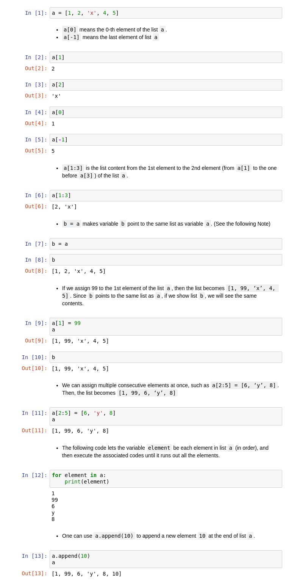
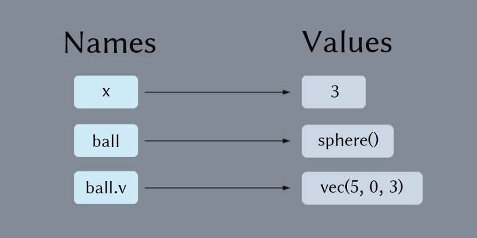
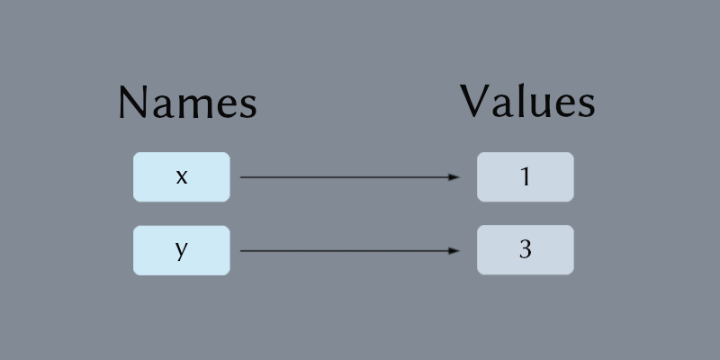
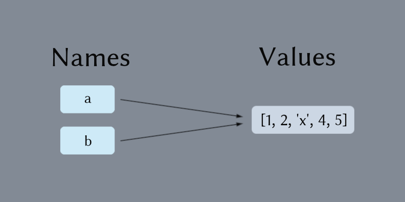
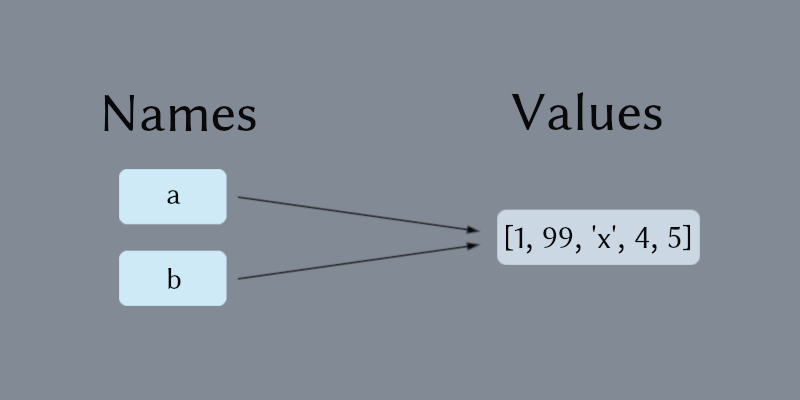

# Homework 3: SHM \[tuple, list, for\]  

這次作業的說明**有些地方和老師的官方版本是不一樣的**，是一些和老師討論過後修改的部份，因為涉及一些重要觀念，希望大家至少在 list 的說明部份以這裡為主喔。

此外，老師在作業部份規定得不夠清楚的部份，我也會在這邊把它規定的更清楚一點，所以希望大家作業規定部份也要看過這邊的版本。

影片和老師的官方作業說明如下，供大家參考用。

+ [影片](https://www.youtube.com/playlist?list=PLxowpOHFnGyMWhKMOp_hcQ8SVXdA7BWvd)
+ [作業說明pdf](VP3.pdf)

### 作業繳交方式（注意！！）

請上傳一個zip檔（壓縮檔，請注意副檔名要是zip）到CEIBA，zip檔內需要包含一個**名稱是自己學號的資料夾**，裡面包含一個或兩個py檔。請將必作部份取名為`must.py`，選作部份取名為`optional.py`。如果這次作業有拍攝影片，**請將影片連結寫在video.txt裡面，並一併放入學號資料夾中**。

範例：
```
homework.zip
└── r07222060
    ├── must.py
    ├── optional.py
    └── video.txt
```

### 繳交期限

`10/25 THU 21:00`

# 作業說明正文

## Contents

+ [List](#I-List)
+ [Simple Harmonic Motion](#II-simple-harmonic-motion)  
+ [Multiballs](#III-multiballs)  
+ [Homework](#IV-homework)  

## I. List

In the picture below, variable `a` is assigned to a "list", which is an "ordered collection of objects". The objects can be integers, floats, strings, lists, or any other objects. In the example here, the 0th element of `a` is integer 1, the 1st is integer 2, the 2nd is "x", and so forth. (Notice that in python, the order starts from 0.) More importantly, the elements of a list can be mixed of any different types.

> 助教註: Here I merged the picture and the words from professor's PDF into a jupyter notebook. You can just look at the screenshot below, but you can also get the [ipynb](example/python_list.ipynb) or [html](example/python_list.html) files if you want.



### Note:

There are two storing spaces in python to store the variables, Namespace and Valuespace. Namespace stores the variable names, such as `x`, `ball`, `ball.v`, etc. Valuespace stores the values, such as `3`, `sphere()`, and `vec(5, 0, 3)`.



When we write `x = 1`, in python, it does the following. First it creates a space in Valuespace and store the value 1 there. Then it creates a variable name `x` in Namespace. Finally, it let `x` be pointed to 1.

When we write `y = x + 2`, it takes out explicitly the value the variable name `x` points to, which is 1, adds it by 2 and gets 3, creates a new space in Valuespace and stores 3 there. Finally, it creates variable `y` and points `y` to this space containing 3.



> 助教註: The following part is written by myself and is different from the professor's PDF. The reason will be told later.

If we write `b = a` like `In [7]` in the screenshot above, because `a` have already pointed to the list `[1, 2, 'x', 4, 5]`, `b` will also point to the same position in Valuespace, where the list is stored.



Then if we let `a[1] = 99`, python will go to the position which `a` points to in Valuespace, and **directly** modify the element `a[1]` stored there. And because `b` points to the same position as `a`, the value of `b` will also become `[1, 99, 'x', 4, 5]`.



Most of the python objects (like vec, sphere, etc) also have this property, so if we write `highest_pos = ball.pos` somewhere in the program, trying to record the highest position of the ball, it may not work. Because `highest_pos` actually points to the same vector as `ball.pos`, its value changes as the ball moving.

However, some objects in python does not have this property. They are the numbers (`int`, `float`, `complex`), `str`, `tuple`, etc. So if we write something like this:

```python
x = 1
y = x
x = x + 2
```

while `x` becomes 3, `y` will still be 1.
 
> 助教註: The fact that the numbers does not have this property is why I rewrite this part. These objects are called immutable object, if you are interested in them you can just google it. Maybe I will write another notes about this several days later.

## II. Simple Harmonic Motion  
```python
from vpython import *

g = 9.8
size, m = 0.05, 0.2
L, k = 0.5, 15
scene = canvas(width=500, height=500, center=vec(0, -0.2, 0), background=vec(0.5, 0.5, 0))
ceiling = box(length=0.8, height=0.005, width=0.8, color=color.blue)
ball = sphere(radius=size, color=color.red)
spring = helix(radius=0.02, thickness=0.01) # default pos = vec(0, 0, 0)
ball.v = vec(0, 0, 0)
ball.pos = vec(0, -L, 0)
  
dt = 0.001 
while True:
    rate(1000)
    spring.axis = ball.pos - spring.pos                                 # new: extended from spring endpoint to ball
    
    spring_force = -k * (mag(spring.axis) - L) * spring.axis.norm()    # to get spring force vector
    ball.a = vector(0, -g, 0) + spring_force / m                       # ball acceleration = - g in y + spring force /m
    
    ball.v += ball.a*dt
    ball.pos += ball.v*dt
```
1. Tuple assignment  
`size, m = 0.05, 0.2` or `(size, m) = (0.05, 0.2)`  
*** `(0.05, 0.2)` is a tuple data type. When two tuples are on either sides of a `=`, the values are assigned term by term. This can be done for as many terms as long as both sides have the same number of variables and values.  
    
2. Draw a spring, by `spring = helix(radius=0.02, thickness=0.01)`, as a helix object with radius = 0.02 and thickness = 0.01. Its endpoint defaults to position vector(0, 0, 0). The parameters can be set by `spring = helix(pos = vector(0,0,0), radius=0.02, thickness =0.01)` when it is constructed, or they can be changed later by assignment, such as `spring.pos = vector(0,0,0)`. The `axis` attribute, such as used in `spring.axis = ball.pos - spring.pos`, draws the spring from `spring.pos` to `ball.pos`  

3. Force vector by the spring,  
    ```python
    spring_force = -k * (mag(spring.axis) - r) * spring.axis.norm()
    ```  
    `mag(a vector)` is a function that yields the magnitude of the vector. The `norm()` ‘method’ will give the unit direction vector of the vector attached, e.g. `spring.axis.norm()` gives the unit direction vector for spring.axis. Can you figure out why this line of code yields the force generated by the spring on the ball?  

4. Find the acceleration  
    ```python
    ball.a = vector(0, -g, 0) + spring_force / m
    ```
## III. Multiballs  
```python
from vpython import *

g = 9.8
size, m = 0.05, 0.2
L, k = 0.5, [15, 12, 17]
v = [1, 2, 2.2]
d = [-0.06, 0, -0.1]

scene = canvas(width=400, height=400, center=vec(0.4, 0.2, 0), align='left', background=vec(0.5, 0.5, 0))
floor = box(pos=vec(0.4, 0, 0), length=0.8, height=0.005, width=0.8, color=color.blue)
wall = box(pos=vec(0, 0.05, 0), length=0.01, height=0.1, width=0.8)

balls = []
for i in range(3):
    ball = sphere(pos=vec(L+d[i], size, (i-1)*3*size), radius=size, color=color.red) 
    ball.v = vec(v[i], 0, 0)
    balls.append(ball)
    
springs =[]
for i in range(3):
    spring = helix(pos=vec(0, size, (i-1)*3*size), radius=0.02, thickness=0.01) 
    spring.axis = balls[i].pos - spring.pos
    spring.k = k[i]
    springs.append(spring)
```
This code generates a list of 3 ball objects on the floor, a list of 3 springs connecting the 3 balls, respectively, to the wall. Have a look how `for` is used in this program.  
The only thing new to you is  
```python
for i in range(3): 
    code....
```
for which `i` is assigned sequentially to 0, 1, and 2 and the associated code are executed. If we want to execute from 1 to 2, we can use  
```python
for i in range(1,3):
    code....
```

## IV. Homework

### Must

Combine the above program and write a simulation program that has three independent horizontal SHMs (of different spring constants, of different starting positions, of different starting velocities).

1. Plot versus time the total of the instant kinetic energies of the three balls, and the total of the instant spring potential energy of the three balls in the same graph.

2. Plot versus time the averaged total kinetic energy over the time period (from the beginning of the simulation till the time of the current plot point) and the averaged total spring potential energy. What interesting results do you find?

Note: The interesting results you find are not required to be answered in the homework, but you can talk about them in the video.

### Optional

First generating two lists,

```python
sizes = [0.06, 0.04]     # for balls’ sizes 
ms = [0.2, 0.12]         # for balls’ mass
```

Instead of hanging one ball on the spring to the ceiling, let the two balls connect together horizontally by the spring. Ignore the gravity and simulate the oscillation of the two-ball system in x axis. The spring constant `L` and length `k` are 0.5 and 15, respectively. Both balls are initially at rest with their positions separated by `1.1*L`. Print the period of the oscillation. (not by formula)  

