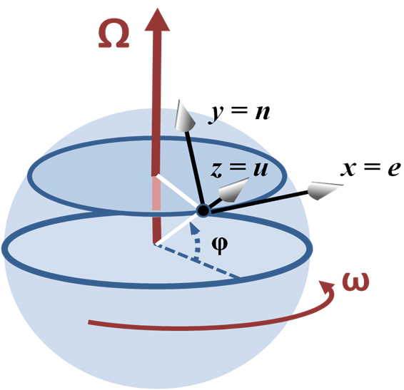

# 提醒事項

### 公告

* 作業二同學們的影片已經公佈囉，在[這邊](https://tinyurl.com/y89fuhtf)，如果你有上傳了但是影片不在裡面記得通知我一聲，有可能是因為你的影片設成私人了（改成不公開後還是要通知我啊）。

* 記得是要**挑四次作業拍影片**，所以就算一次作業分成兩次上傳還是只能算成一次喔。（不過必選作都有解釋會另外加分）

### 概念補充

* 做模擬的時候，用先算加速度 - 速度 - 位置的順序來計算，誤差會比較小喔。事實上已經有同學親身經歷了，如果作業三把`x`和`v`的順序換一下的話，動能就會不斷增加……
  ```python
  # Use HW3 as an example
  a = -k*x / m
  v += a*dt
  x += x*dt
  ```

# Homework 4: Collision and pendulum [function]

作業有做了一個**額外的要求**，**在老師原本的PDF裡面是沒有的**，請至少務必要看過這份文件的 [Homework](#iii-Homework) 部份。

照例，影片和老師的官方作業說明如下，供大家參考用。

+ [影片](https://goo.gl/y2mXQn)
+ [作業說明pdf](VP4.pdf)

## 作業繳交方式

請上傳一個zip檔（壓縮檔，請注意副檔名要是zip）到CEIBA，zip檔內需要包含一個**名稱是自己學號的資料夾**，裡面包含一個或兩個py檔。請將必作部份取名為`must.py`，選作部份取名為`optional.py`。如果這次作業有拍攝影片，**請將影片連結寫在video.txt裡面，並一併放入學號資料夾中**。

範例：
```
the_zip_file.zip
└── r07222060
    ├── must.py
    ├── optional.py
    └── video.txt
```

## 繳交期限

`2018/11/03 SAT 21:00`

# 作業說明正文

## Contents

+ [Collision](#i-Collision)
+ [Pendulum](#ii-Pendulum)
+ [Homework](#iii-Homework)

## I. Collision

```python
from vpython import *

size = [0.05, 0.04]     					   # ball radius
mass = [0.2, 0.4]       					   # ball mass
colors = [color.yellow, color.green]           # ball color
position = [vec(0, 0, 0), vec(0.2,-0.35, 0)]   # ball initial position
velocity = [vec(0, 0, 0), vec(-0.2, 0.30, 0)]  # ball initial velocity

scene = canvas(width=800, height=800, center=vec(0, -0.2, 0), background=vec(0.5, 0.5, 0)) # open window
ball_reference = sphere(pos=vec(0,0,0), radius=0.02, color=color.red)

def af_col_v(m1, m2, v1, v2, x1, x2):          # function after collision velocity
    v1_prime = v1 + 2*(m2/(m1+m2))*(x1-x2) * dot (v2-v1, x1-x2) / dot (x1-x2, x1-x2)
    v2_prime = v2 + 2*(m1/(m1+m2))*(x2-x1) * dot (v1-v2, x2-x1) / dot (x2-x1, x2-x1)
    return (v1_prime, v2_prime)

balls = []
for i in [0, 1]:
    balls.append(sphere(pos=position[i], radius=size[i], color=colors[i]))
    balls[i].v = velocity[i]
    balls[i].m = mass[i]

dt = 0.001
while True:
    rate(1000)

    for ball in balls:
        ball.pos += ball.v*dt
    if (mag(balls[0].pos - balls[1].pos) <= size[0]+size[1] and dot(balls[0].pos-balls[1].pos, balls[0].v-balls[1].v) <= 0) :
        balls[0].v, balls[1].v = af_col_v (balls[0].m, balls[1].m, balls[0].v, balls[1].v, balls[0].pos, balls[1].pos)
```

This program demonstrates an elastic collision event between two balls.

### Function

There are generally two cases in which we want to write a section of codes as a function. In one, we want to reuse many times the same section of codes. In the other, we want to make the entire codes more readable. Here is the example function that yields the velocities of two spherical objects after an elastic collision.

```python
def af_col_v(m1, m2, v1, v2, x1, x2):          # function after collision velocity
    v1_prime = v1 + 2*(m2/(m1+m2))*(x1-x2) * dot (v2-v1, x1-x2) / dot (x1-x2, x1-x2)
    v2_prime = v2 + 2*(m1/(m1+m2))*(x2-x1) * dot (v1-v2, x2-x1) / dot (x2-x1, x2-x1)
    return (v1_prime, v2_prime)
```

The first line `def af_col_v(m1, m2, v1, v2, x1, x2):` declares the function name `as af_col_v` by `def`. The function name is better to have meaning, here it means "after collision velocities". After the function name is the
parentheses and a colon. Inside the parentheses can be empty or any parameters which pass information from the main program to the function. In this case, they are `m1`, `m2`, `v1`, `v2`, `x1`, `x2` for masses, velocities, and positions of the two objects, respectively.

The subordinate codes below the colon are the major part of the function that handles the job. Here, they calculate the velocities after collision from the masses, velocities, and positions of the two spherical objects and put them into two variables, `v1_prime` and `v2_prime`. In the last line, it **return** the values of the two variables back to where the function is called.

Say if we have the following code

```python
V1, V2 = after_col_v(0.5, 0.6, vec(1, 2, 3), vec(4, 5, 6), vec(1, 0, 1), vec(0, 1, 1))
```

It will call the `after_col_v` function and let `m1` = 0.5, `m2`= 0.6, `v1` = vec(1, 2, 3)..., and so on. And after the function is executed, `V1` and `V2` will be the values of `v1_prime` and `v2_prime`, respectively. Note that this way of calling function is ‘call by position’, i.e. the parameters are matched by position order. We can also do this by ‘call by keywords’, such as

```python
V1, V2 = after_col_v(v1=vec(1, 2, 3), v2=vec(4, 5, 6), m2=0.6, x1=vec(1, 0, 1), x2=vec(0, 1, 1), m1=0.5)
```

Within the parentheses, the parameter order is not at all important, since the parameter is assigned explicitly.

## II. Pendulum

```python
from vpython import *

g = 9.8
size, m = 0.02, 0.5
L, k = 0.5, 15000

scene = canvas(width=500, height=500, center=vec(0, -0.2, 0), background=vec(0.5, 0.5, 0))
ceiling = box(length=0.8, height=0.005, width=0.8, color=color.blue)
ball = sphere(radius=size, color=color.red)
spring = cylinder(radius=0.005)   # default pos = vec(0, 0, 0)
ball.v = vec(0.6, 0, 0)
ball.pos = vec(0, -L - m*g/k, 0)

dt = 0.001
t = 0
while True:
    rate(1000)
    t += dt
    spring.axis = ball.pos - spring.pos                              # spring extended from endpoint to ball
    spring_force = - k * (mag(spring.axis) - L) * spring.axis.norm() # to get spring force vector
    ball.a = vector(0, - g, 0) + spring_force / m                    # ball acceleration = - g in y + spring force /m

    ball.v += ball.a*dt
    ball.pos += ball.v*dt
```

Does this program look familiar? Yes, it is only different from the ‘simple harmonic motion’ program in homework 3 by 4 lines: `ball.v = ...`, `ball.pos = ...`, `spring = ...`, and `L, k = 0.5, 15000`. But now, instead of an oscillating spring-ball system, we have a pendulum. Let’s see how
the difference of the program works.

Since we want to have a pendulum, i.e. a massive object attached to a rope, we need to have a rope. `spring` is therefore changed from a helix to a cylinder for the shape of a rope. More, when you try use a force to stretch a rope, there is a tension on the rope, and the tension is equal to the force. Also, the extension of the rope is very tiny, this means that the rope is just like a spring but with a very large spring constant. Thus, we set `k = 15000`, any large number will do, but do not let it be too large or too small, which will cause the simulation to be very unstable. Due to gravitation, the rope is stretched a bit from its original length, therefore `ball.pos = vec(0, -L - m*g/k, 0)`. The ball is set to have an initially horizontal velocity, `ball.v = vec(0.6, 0, 0)`. Then, we have a pendulum simulation.

This simulation is more “fundamental” than the pendulum analysis in the high school physics. The ball is exerted by two forces, one gravitational force and the other is the tension from the string. As the ball is swinging at the bottom of the string, it is doing a circular motion that requires a centripetal force. But how does the string “know” exactly how much force to exert on the string to make the ball to move in a circular motion as the ball velocity is changing all the time? A traditional way to analyze the pendulum never mentions this. By a careful examination, we will find actually the string must be stretched a little bit to provide the extra force as the centripetal force. This is what we do in this simulation.

## III. Homework

### Must

Combine I. and II., and the list in VP3 to write a program for **Newton’s cradle** with 5 balls. Please add these following codes in the top of your code

> 助教註: 這段 code 是我加的，它只是為了讓我在改作業的時候可以用 `input` 來設定 `N` 而已，它完全不會影響你們的程式運作（除非你電腦的使用者名稱和我一樣XD）。總之，**記得把這段程式碼放在你的程式最前面，然後只在 `# Set your N here` 的那行定義 `N`**，就可以不用再理會它了。


```python
import getpass

if getpass.getuser() == 'hanson':
    N = int(input('>> '))
else:
    N = # Set your N here
```
You have to use `N` to indicate how many balls (1 - 4) are lifted at the beginning. Make sure that the program works for N = 1, 2, 3, 4.

### Optional

We can add Coriolis force to the pendulum system. We assume the pendulum is set at latitude of φ, and the direction to the east is toward +x, the direction to the north is toward –z, and the direction to the sky is
toward +y (**Notice: it is different from the following figure**). For a quicker and better observation, we can let the simulation run at `rate(10000)`. If we project the swing onto the x-z plane, we will see the motion of the projection similar to a harmonic oscillation, originally oscillating in x-axis. Find the angle deviation of the swing projection from its original direction (+x axis) after 1000 periods of the pendulum if the pendulum is
in Taipei and of 2m long and with a still start angle at 30 degrees.

Notice: When we have a coordinate attached on a rotating sphere as in the figure, the Coriolis acceleration is shown as the equation below the figure, where <a href="https://www.codecogs.com/eqnedit.php?latex=\inline&space;\dpi{150}&space;v_n" target="_blank"></a> , <a href="https://www.codecogs.com/eqnedit.php?latex=\inline&space;\dpi{150}&space;v_n" target="_blank"></a>, and <a href="https://www.codecogs.com/eqnedit.php?latex=\inline&space;\dpi{150}&space;v_n" target="_blank"></a> are the velocity to the east, to the sky, and to the north.



(https://upload.wikimedia.org/wikipedia/commons/8/8a/Earth_coordinates.PNG)

<a href="https://www.codecogs.com/eqnedit.php?latex=\dpi{150}&space;\vec{a_C}&space;=&space;-2\vec{\Omega}&space;\times&space;\vec{v}&space;=&space;2&space;\omega&space;\begin{pmatrix}&space;v_n&space;\sin&space;\phi&space;-&space;v_u&space;\cos&space;\phi\\&space;-v_e&space;\sin&space;\phi\\&space;v_e&space;\cos&space;\phi&space;\end{pmatrix}" target="_blank"></a>

