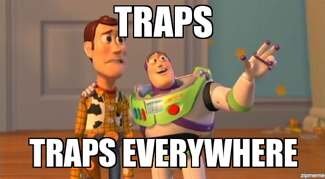
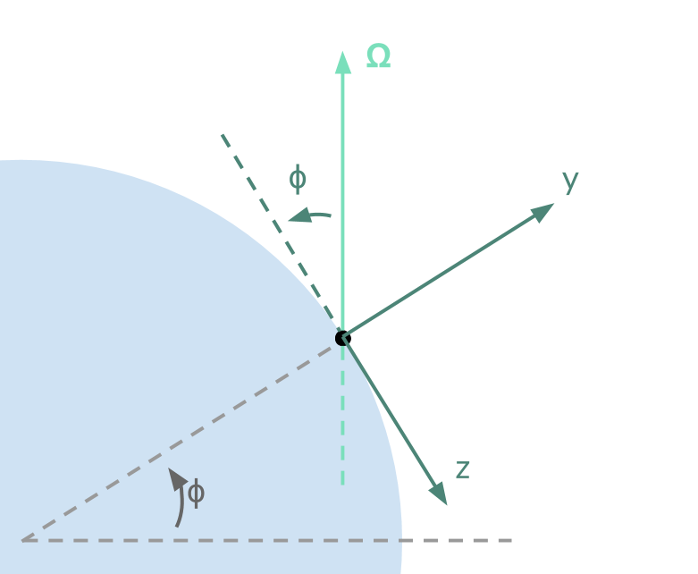

# Homework 4 Grading

Because there are too many traps in the optional part, so there will be a special treatment on your grades.

好我發現我好像沒必要打英文，先說明一下有什麼陷阱吧。

第一個老師其實有提醒過了，不過我還是在這邊提一下。就是呢，老師指定的座標軸和附圖是不一樣的，我們的 `y` 軸是要指向天空，而 `z` 軸是要指向**南方**的，跟圖很不一樣，而且因為有正負號差異讓人頭昏腦脹的。

這個部份雖然討厭了一點，不過因為老師提醒過了，所以我基本上還是會扣分，但是接下來附的公式還隱藏了第二個陷阱：

很多人會以為，只要把 、 和  換成我們座標軸裡對應的 、 和  就好了，但**這是錯的**。因為這個式子裡有兩個向量  和  ，這麼做等於是只對後者做了座標系轉換，但卻忘了前者在新的座標底下各分量也會長得不一樣。

要得到新的公式，我們要先把  投影到我們座標系的各個分量上：

然後代進公式裡算外積可以得到：

 

可以看到，跟直接只把速度分量代換掉的結果比起來，正確的結果不但少了一個負號、sin 跟 cos 還互換了位置，所以算出來的答案也差很多。當然，如果你們像我一樣覺得寫太多分量很麻煩，直接讓 vpython 算 `-2 * omega_vector.cross(ball.v)` 的話，那就自然不會有這個問題了。

用正確的加速度算出來的答案會是 `6.34` 左右，而用錯的公式算出來的會在 `13.55` 左右（`dt` 用 `0.0001`。因為公式陷阱實在太機車了（尤其還特地提醒你們圖有陷阱，導致你們對公式大意了XD），所以我這次除了原先給的標準以外，還會特別處理兩個情況：

* 算出來的答案在 `13.55` 附近: 那我直接用 `13.55` 當正確答案來計算分數（因為分數是看你們多接近正確答案）。
* 算出來的答案離兩者都差很遠: 幫你看一下 code，如果你踩到的是第一個（老師提過的）陷阱，那我會幫你們修正並扣 20% ，再用修正過後的答案來給分。
 
