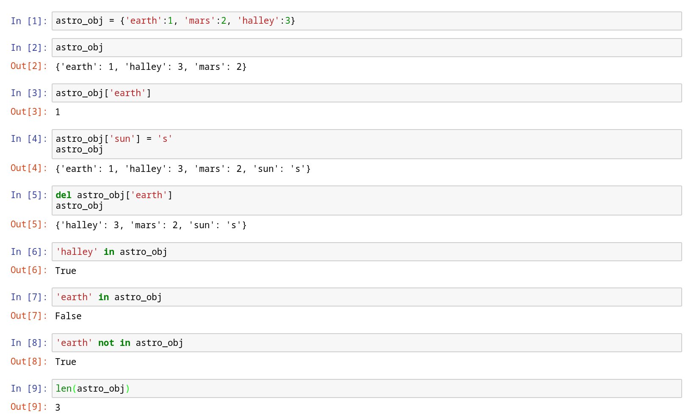
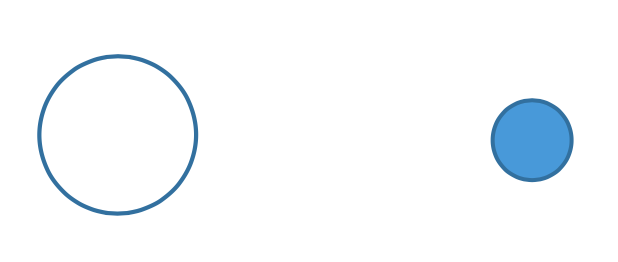

# Homework 5: Kepler's Planet motion, and Precession of Moon's orbit [Dict, Class]  

提醒一下，這次作業當然懂的人做起來還是很快，但是比較不熟悉這個的同學可能會花比較多時間寫這次作業，期中考完記得不要太晚開始寫喔。

這次的作業老師拋了一大堆新名詞、新概念進來，如果有人對 class 不熟悉又沒有看影片的習慣，這次我非常建議你去看過。我有自行整理和稍微補充一點名詞的解釋在 Part II 最後面，如果還是不明白記得可以找我問清楚。

另外，我原本想在發布作業的時候順便稍微講一下怎麼看 Python 的錯誤訊息的，不過這次的文件花了我不少時間，以至於來不及放上來。等我弄好之後我會放在這邊，也會放在下次作業，到時候每次出現 error 都不知道怎麼辦的人可以看看。（真的不會講太多東西就是了）

## 影片以及官方pdf

+ [影片](https://goo.gl/S5zf6S)  
+ [官方pdf](VP5.pdf)  

## 作業繳交格式

請上傳一個zip檔（壓縮檔，請注意副檔名要是zip）到CEIBA，zip檔內需要包含一個**名稱是自己學號的資料夾**，裡面包含一個py檔，取名為`must.py`。如果這次作業有拍攝影片，**請將影片連結寫在video.txt裡面，並一併放入學號資料夾中**。

> #### **注意就算只有一個檔案還是要放進壓縮檔上傳喔。**

範例：
```
the_zip_file.zip
└── r07222060
    ├── must.py
    └── video.txt
```

## 繳交期限  
尚未公佈  

## Contents  

+ [Python Dictionary](#i-python-dictionary)  
+ [Python Class](#ii-python-class)  
+ [Kepler's Law](#iii-kepler's-law)  
+ [Homework](#iv-homework)  

## I. Python Dictionary  

(Read these with the image below)

1. Dictionary is a key-to-value mapping data type. You can generate the dictionary by `d = {key1:value1, key2:value2, key3:value3,...}`. For example, `astro_obj` is a dictionary with “earth”, “mars”, and “halley” as its keys, and the corresponding values are 1, 2, and 3, respectively.  
2. `d[key]` gets the `value` stored in `d` indicted by `key`.  
3. `d[key] = value` assigns the `key` in `d` to `value`.  
4. `del d[key] `deletes the `key` and `value` all together in `d`.  
5. `key in d` yields True if `key` is in `d`, else gives False (Note: This can also be used for list).  
6. `key not in d` yields True if `key` is not in `d`, else gives False (also can be used for list).  
7. `len(d)` gives the number of stored data in `d` (also can be used for list).  
8. `dict.copy()` returns a complete copy of dict.  

  

## II. Python Class

> #### 助教註: 
> If you can't understand anything in the following, it's strongly recommended to look at Professor's video. You can also take a lot at the end of this part, where I organize the explanations of the terms. Hope it could make the concepts clearer.

In the following program, we will define a class for the first time in this series of course. Actually, we have used `class` in every previous homework, which are `sphere`, `box`, and `helix`, provided by the vpython module (they are called to work by the code `from vpython import *`). The following is the free fall program (from VP1) with a modification to include `class`. Usage of class is addressed in the remarks.

```python
from vpython import *

g, size, height = 9.8, 0.25, 15.0
class any_ball(sphere):
    m = 1.0
    v = vector(0,0,0)
    def kinetic_energy(self):
        return 0.5 * self.m * mag(self.v)**2

scene = canvas(width=800, height=800, center=vec(0, height/2, 0), background=vec(0.5, 0.5, 0))
floor = box(length=30, height=0.01, width=10, color=color.blue)
ball = any_ball(radius=size, color=color.red) 
print(ball.m, ball.v, ball.kinetic_energy())    

ball.pos, ball.v, ball.m = vector(0, height, 0), vector(0, 0, 0), 3.0
dt = 0.001
while ball.pos.y >= size:
    rate(1000)
    ball.pos += ball.v*dt 
    ball.v.y += -g*dt
print(ball.m, ball.v, ball.kinetic_energy())    
```

1. 
    ```python
    class any_ball(sphere):          
        m = 1.0                      
        v = vector(0,0,0)            
        def kinetic_energy(self):    
            return 0.5 * self.m * mag(self.v)**2
    ```
    + Declare `any_ball` a class with properties (attributes and methods) inherited from `sphere`.  
    + If objects generated by `any_ball` do not have their own attributes `m` and `v`, they will inherit class’s attributes here, i.e., `m` and `v`.  
    + `def kinetic_energy(self): ` declaring a method, which is a function belonged to a specific class. The way it works is the same as a function,  except that its first argument is always self, the object calling this method.  

2. 
    ```python
    ball = any_ball(radius=size, color=color.red)
    print(ball.m, ball.v, ball.kinetic_energy()) 
    ```
    + Generate `ball` as an object belonged to `any_ball` class, and passing arguments into `any_ball`’s initializing function `__init__()`.  
    + Print `ball.m`, `ball.v`, but since `ball` does not have attributes `m` and `v` yet. It uses `any_ball` class’s `m` and `v`. And `ball.kinetic_energy()` calls the kinetic_energy method.  
3. 
    ```python
    while ball.pos.y >= size:
        rate(1000)
        ball.pos += ball.v*dt 
        ball.v.y += -g*dt
    print(ball.m, ball.v, ball.kinetic_energy())
    ```
    + Now `ball` has its attributes `m` and `v`. Print `ball.m`, `ball.v` and `ball.kinetic_energy()` as well.  

> #### 助教註: 
> I collect the explanations of the terms together here . Feel free to skip them if you know the python classes well.
> * class(類別): A class is like a template or a model of python objects. We use classes to define the methods and the attributes in the objects. For example, `sphere`, `helix`, `vector` in vpython are classes. (They are classes defined by the authors of VPython)
> * method(方法): A method is just like a function belonging to the class. Generally, we uses methods to perform the operations inside the class, so that the code would not be too complicated. For example, `vector.norm()` in vpython returns the unit vector along the vector, and here `norm()` is a method of `vector`. So we could use `spring.axis.norm()` instead of `spring.axis/mag(spring.axis)` in HW3.
> * attribute(屬性): An attribute is like a variable belonging to the class, or a feature of the class. Attributes store the information about the class object. For example, `pos`, `radius`, `color` are all attributes of the class `sphere`, and we can get access to these attributes by `ball.pos`, `ball.radius`, etc, if we have set `ball = sphere()`.
> * `self`: In python, `self` is used in a class to represent the object itself. Here we use the definition of `any_ball` above as an example. If we create an `any_ball` object called `ball_1`, then `ball_1.kinetic_energy()` will use `ball_1.m` and `ball_1.v` to calculate the return value.
> * inherit(繼承): If there are two class `A` and `B` ,with `B` inheriting from `A`, it means that `B` will by default have the same attributes and methods of `A` , unless we re-define them. In the codes above, the class `any_ball` works just like a `sphere` with the new defined `m`, `v`, and `kinetic_energy()`. If we write nothing in the definition of `any_ball` like:
>   ```python
>   class any_ball(sphere):
>       pass
>   ```
>   Then `any_ball` would be nothing but just a `sphere`.
> 
> I have tried, but I think it's still not clear enough, so if you have any problems just feel free to ask me.
> * If you are curious about the `__init__()` function: https://openhome.cc/Gossip/Python/Class.html  
> * If you want to know more about the inheritance of class in python: https://openhome.cc/Gossip/Python/Inheritance.html  
## III. Kepler's Law  
This program uses function, class, and dictionary to construct a solar model including planets Earth and Mars and comet Halley.  
```python
from vpython import*

G = 6.673E-11
mass = {'sun': 1.989E30, 'earth': 5.972E24, 'mars': 6.4169E23, 'halley': 2.2E14}
d_at_perihelion = {'earth': 1.495E11, 'mars': 2.279E11, 'halley': 8.7665E10}
v_at_perihelion = {'earth': 2.9783E4, 'mars': 2.4077E4, 'halley': 54563.3}

def G_force(m, pos_vec):
    return -G * mass['sun'] * m / mag2(pos_vec) * norm(pos_vec)

class as_obj(sphere):
    def kinetic_energy(self):
        return 0.5 * self.m * mag2(self.v) 
    def potential_energy(self):
        return -G * mass['sun'] * self.m / mag(self.pos)

scene = canvas(width=800, height=800, background=vector(0.5,0.5,0))
scene.lights = []
sun = sphere(pos=vector(0,0,0), radius=3.0E10, color=color.orange, emissive=True)
local_light(pos=vector(0,0,0))

earth = as_obj(pos=vector(d_at_perihelion['earth'],0,0), radius=1.5E10, m=mass['earth'], texture={'file':textures.earth}, make_trail=True) 
earth.v = vector(0, 0, -v_at_perihelion['earth'])
mars = as_obj(pos=vector(d_at_perihelion['mars'],0,0), radius=1.0E10, m=mass['mars'], color = color.red, make_trail=True)
mars.v = vector(0, 0, -v_at_perihelion['mars'])
halley = as_obj(pos=vector(d_at_perihelion['halley'],0,0), radius=0.5E10, m=mass['halley'], make_trail=True)
halley.v = vector(0, 0, -v_at_perihelion['halley'])

stars = [earth, mars, halley]
dt=60*60*6
print(earth.potential_energy(), earth.kinetic_energy())

while True: 
    rate(1000)
    for star in stars:
        star.a = G_force(star.m, star.pos) / star.m 
        star.v = star.v + star.a * dt
        star.pos = star.pos + star.v * dt
```

> #### 助教註:
> * `6.673E-11` or `6.673e-11` both mean <a href="https://www.codecogs.com/eqnedit.php?latex=6.673&space;\times&space;10^{-11}" target="_blank"></a>.
> * Similarly, `1E10`, `1e10`, `1E+10`, and `1e+10` mean <a href="https://www.codecogs.com/eqnedit.php?latex=1&space;\times&space;10^{10}" target="_blank"></a>
> * `mag2(vector)` equals `mag(vector)**2`

In this program, we create a function `G_force(m, pos_vec)` to find the gravitational force from sun acted on an astronomical object with mass `m` and at position `pos_vec`. We also create a class `as_obj`, inheriting all its attributes and methods from `sphere` provided by vpython, with two additional methods that calculate the `kinetic_energy `and `potential_energy`.  

We also kill the original global lighting in the virtual world by `scene.lights = []`, and provide the light source at `vector(0,0,0)`, which is the position of the sun, by `local_light(pos=vector(0,0,0))`. This will provide the proper shade for earth and mars. We also plot the earth with its full geographical feature by putting `texture={'file':textures.earth}` in its creating method when the earth object is created.  

## IV. Homework  

Because there's no optional part this time, the score of the must-do part would be 1.25 point. And because the must-do part is quite long this time, the grading policy would also be attached at the end of this document.

### MUST: Moon Orbit Precession
```python
mass = {'earth': 5.97E24, 'moon': 7.36E22, 'sun': 1.99E30}
radius = {'earth': 6.371E6*10, 'moon': 1.317E6*10, 'sun': 6.95E8*10} #10 times larger for better view 
earth_orbit = {'r': 1.495E11, 'v': 2.9783E4}
moon_orbit = {'r': 3.84E8, 'v': 1.022E3}
theta = 5.145*pi / 180.0
```
The above code provides the parameters that you will need for the moon orbit precession simulation. In these, the radii of earth, moon, and sun are deliberately magnified by 10 times for better viewing. The `earth_orbit` provides the orbit radius (`'r'`) and orbit speed(`'v'`) for the orbit of the earth around the sun. The `moon_orbit` provides the orbit radius (`'r'`) and orbit speed(`'v'`) for the orbit of the moon around the earth. `theta` is the angle between the normal vector of earth orbit plane and the normal vector of moon orbit plane. Here, it is demonstrated how to construct a simulation project, building from a simple system to a more complex one step by step, to eliminate unintentional errors and to reduce debug time.  

1. Construct two sphere objects, earth and moon. Let `earth.m = mass['earth']` and `moon.m = mass['moon']`. Assign the attributes:
   ```python
   earth.pos = vector(0, 0, 0)
   moon.pos = vector(moon_orbit['r'], 0, 0)
   moon.v = vector(0, 0, -moon_orbit['v'])
   ```
   Applying the gravitational force acting on moon only by fixing the position of earth, you will observe the moon orbiting around earth. You can change the initial view angle by setting `scene.forward = vector(0, -1, 0)` for a top-view observation. Note: Do NOT leave a trail for the moon orbit, because when later earth is going around the sun, the trail will be very messy.  
  

> 助教註: Here if you want to examine the motion of the moon, you can set a smaller dt, like 60 seconds, for debugging.

2. However, we know that 1. is not entirely correct since (1) earth’s position is not fixed and (2) gravitational force is also acted on the earth. Therefore, you need to modify your program for these conditions. However, if you simply add the gravitational force on earth, you will find two interesting results. One is that the earth also does a small orbiting motion, which is correct, because the center of mass of the earth-moon system is not on the center of earth. The other one is that the earth-moon system continues to move in –z direction. This is not surprising at all, because in the initial **total linear momentum = earth.m \* earth.v + moon.m \* moon.v** is non-zero and toward –z direction. You need to modify your initial conditions (i.e. `earth.pos`, `earth.v`, `moon.pos`, `moon.v`) to make the center of mass of the earth-moon system to be fixed at the Origin, i.e. `vector(0, 0, 0)`.  

3. Now, change the positions of both earth and moon to make the normal vector of the moon’s orbit tilted toward +x direction with the tilting angle = `theta`. Then, you will see the moon orbiting earth with a tilted angle. To see this, remove(or remark) the line `scene.forward = vector(0, -1, 0)` to observe the tilted orbit.  

   To make the observation from the point of view of earth, we can set the center of the world at the earth by `scene.center = earth.pos`. This way, we will see on screen a standing-still earth though the position of earth is changing all the time.  

4. Now, you can add the sun, with its designated mass and its position at Origin, i.e. `vec(0, 0, 0)`. Also set the center of mass of the earth-moon system at `vector(earth_orbit['r'], 0, 0)` by changing accordingly the positions of earth and moon to their suitable positions. Since now the earth-moon system is rotating around the sun, therefore remember to add the earth-orbiting velocity `vector(0, 0, -earth_orbit['v'])` to both `earth.v` and `moon.v`. Also remember to add the gravitational force by sun acted on both earth and moon. Keep the `scene.center = earth.pos`.  

   Run your simulation, you will at first not see the earth and moon because as compared to the sun-earth distance, the earth and moon system is too small. Use your mouse to move closer, then you will observe the moon orbiting the earth. Wait for a bit longer, you will see that the tilting angle of the moon orbit is changing, which indicates the precession of moon’s orbit.  
5. Find and show the period of the precession of moon’s orbit around the Earth.  

Note: Now you have the orbits of the moon around the earth and the related precession, and the orbit of the earth around the sun. Combining these two will allow you to calculate the timing for moon eclipse and sun eclipse.  

## V. Grading Policy

1. Make the moon orbit the earth (20%)
2. Make both the earth and the moon orbit their center of mass (20%)
3. Make the moon orbit the earth with a tilted angle (20%)
4. Simulate the moon orbit precession (20%)
5. Correctly show the period of the precession of the moon orbit (20%)
