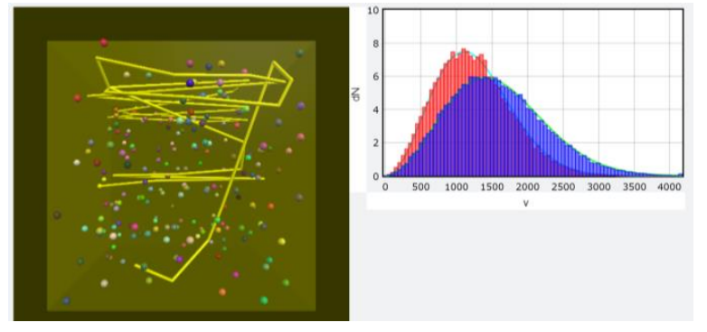

<style>
.center {
  display: block;
  margin-left: auto;
  margin-right: auto;
  margin-top: 10px;
  margin-bottom: 20px;
}
</style>

# Homework 9: Spring-Ball Wave and Dispersion of 1D phonon [numpy array]

因為這次作業依然沒有 Optional 部份，所以 Must 部份的總分是 1.25 分。

## 影片以及官方PDF  

+ [影片](https://goo.gl/fYz6QZ)   
+ [官方PDF](VP9.pdf)  

## 作業繳交格式

請上傳一個 zip 檔（壓縮檔，請注意副檔名要是 zip）到 CEIBA，zip 檔內需要包含一個**名稱是自己學號的資料夾**，裡面包含兩個 py 檔 `VP9.py` 和 `histogram.py`。如果這次作業有拍攝影片，**請將影片連結寫在video.txt裡面，並一併放入學號資料夾中**。

就算只有一個檔案也請大家務必上傳 zip 檔，不要直接上傳 py 檔。

範例：
```
the_zip_file.zip
└── r07222060
    ├── VP9.py
    ├── histogram.py
    └── video.txt
```

### 繳交期限

`2019/01/13 SUN 21:00`

## Contents  

- [I. Callback and Keyboard Control](#i-callback-and-keyboard-control)  
- [II. Histogram Module](#ii-histogram-module)  
- [III. Template File for Gas in a Container](#iii-template-file-for-gas-in-a-container)  
- [IV. Homework](#iv-homework)

## I. Callback and Keyboard Control  

In some programs, e.g. games, you use mice or keyboards to control things but at the same time, the programs continue running. An interrupt callback function can help you do this kind of work. The following example shows how to use arrow keys and letter keys (‘i’, ‘o’, ‘r’, ‘c’) to control the earth’s position and rotation axis while the earth continues spinning. However, **in Jupyter this will not work** since Jupyter console has a higher priority accessing to the keyboard than your vpython program. As a result, your program will not know if a keyboard is pressed or not. You can use the method marked as ##(for JUPYTER also for VIDLE).

### Code for ones not using Jupyter


```python
from vpython import *

pos, angle = vector(0, 0, 0), 0

def keyinput(evt): #keyboard callback function
    global pos, angle
    move = {'left': vector(-0.1, 0, 0), 'right': vector(0.1, 0, 0),
            'up': vector(0, 0.1, 0), 'down': vector(0, -0.1, 0),
            'i' : vector(0, 0, -0.1), 'o': vector(0, 0, 0.1)}
    roa =  {'c' : pi / 90.0 , 'r': - pi / 90.0}
    s = evt.key
    
    if s in move:
        pos = pos + move[s]
    if s in roa:
        ball.rotate(angle=roa[s], axis=vector(0, 0, 1), origin=ball.pos)
        angle = angle - roa[s]

scene = canvas(width=800, height=800, range=5, background=color.white)
ball = sphere(radius=2.0, texture=textures.earth )
scene.bind('keydown', keyinput)  # setting for the binding function

while True:
    rate(1000)
    ball.rotate(angle=pi/600, axis=vector(sin(angle), cos(angle) ,0), origin=pos)
    ball.pos = pos
```

In `def keyinput(evt)`, which is the interrupt callback function, `global` declares the variables (`pos`, `angle`) to be global variables, meaning their values will be known to the entire program (exceeding the scope of this function).

`s = evt.key` gets the key that is pressed-down. Then you can decide what to do with `s`. `ball.rotate(angle=roa[s], axis=vector(0, 0, 1), origin=ball.pos)` will rotate `ball` with an `angle`, around `axis` that passes through `origin`. Any vpython drawn object, such as `sphere` or `box`, can be rotated by this `rotate` method.

In the main program, command `scene.bind('keydown', keyinput)` binds `keyinput` with `scene`. When your active window is scene and the event `'keydown'` (here, a key of the keyboard is pressed) happens, no matter at which part of the program it is now being executed, the bound function, `keyinput()`, will interrupt and be executed right away. After the bound function has finished, the program will go back to the program where it has left just before the interrupt event has happened.

* More information about keyboard operation can be found at 
  http://www.glowscript.org/docs/VPythonDocs/keyboard.html.
* Similar working principle applies to mouse. You can also find mouse operation at
  http://www.glowscript.org/docs/VPythonDocs/mouse.html.

### Code for Jupyter (also available for other environments)


```python
from vpython import *

pos, angle = vector(0, 0, 0), 0

def right(b):    #callback function
    global pos, angle
    pos = pos + vector(0.1, 0, 0)

def left(b):
    global pos, angle
    pos = pos + vector(-0.1, 0, 0)

scene = canvas(width=400, height=400, range=5, background=color.white)
ball = sphere(radius=2.0, texture=textures.earth )
button(text='right', pos=scene.title_anchor, bind=right)
button(text='left', pos=scene.title_anchor, bind=left)

while True:
    rate(1000)
    ball.rotate(angle=pi/600, axis=vector(sin(angle), cos(angle), 0), origin=pos)
    ball.pos = pos
```

In `def right(b)`, which is the interrupt callback function, `global` declares the variables `pos` and `angle` to be global variables, meaning their values will be known to the entire program (exceeding the scope of this function). When this function is executed, pos is added by vector(0.1, 0, 0). The same is applied similarly to `def left(b)`. You can write similar functions to control the `pos` or the `angle`.

In the main program, command `button(text='right', pos=scene.title_anchor, bind=right)` creates a button with `text='right'` with the button’s position set by `pos=scene.title_anchor`. The most importantly, this button is bound to function `right` by `bind=right`, meaning that if this button is clicked, the bound function will be executed no matter at which part of the program it is now being executed, the bound function, `right()`, will interrupt and be executed right away. After the bound function has finished, the program will go back to the program where it has left just before the interrupt event has happened.

In the main loop `ball.rotate(angle=pi/600, axis=vector(sin(angle), cos(angle), 0), origin=pos)` will rotate `ball` with an `angle`, around `axis` that passes through `origin`. Any vpython drawn object, such as `sphere` or `box`, can be rotated by this `rotate` method.

* More information about buttons and other similar features can be found at
  http://www.glowscript.org/docs/VPythonDocs/controls.html

## II. Histogram Module  


### Do save these codes as `histogram.py` in your homework folder

```python
import numpy as np
import vpython as vp

class ghistogram:
    def __init__(self, graph, bins, color=vp.color.red):
        self.bins = bins
        self.slotnumber = len(bins)
        self.slotwidth = bins[1] - bins[0]
        self.n = 0
        self.slots = np.zeros(len(bins))
        self.bars = vp.gvbars(graph=graph, delta=self.slotwidth, color=color)

    def plot(self, data):
        currentslots = np.zeros(self.slotnumber)
        for value in data:
            currentslots[min(max(int((value - self.bins[0])/self.slotwidth), 0), self.slotnumber-1)] += 1

        self.slots = (self.slots * self.n + currentslots)/(self.n + 1)
        self.n += 1
        if self.n == 1:
            for (currentbin, barlength) in zip(self.bins, self.slots):
                self.bars.plot( pos = (currentbin, barlength))
        else:
            self.bars.data = list(zip(self.bins, self.slots))

if __name__ == '__main__':
    vdist = vp.graph(width=450)
    observation = ghistogram(graph=vdist, bins=np.arange(1, 3, 0.5))
    observation.plot(data=[1.2, 2.3, 4])
    observation.plot(data=[1, 1.7, 2.6])
    observation.plot (data=[-0.5, 2, 2.3])
```

This module provides you the `ghistogram` class to plot the histogram for a series of data. Remember to put this file **`histogram.py`** in the same folder as your main program. If you are interested in how this class is written, you can look at the details of the program, otherwise, you just use this module to finish your homework.

Under `if __name__ == '__main__':` shows how to use it. You first import vpython and create a graph (here it is `vdist`). Then you can create an `ghistogram` object (here it is `observation`), in which it must specified in which graph it should display (`graph=vdist`), the bins (here it is 1-1.5, 1.5-2, 2-2.5, 2.5-3), and the color of the histogram. If you do not specify what color the histogram should be, it defaults to red. Then in the method `observation.plot`, you give the `data` (can be list or array), it then counts the number of occurrence of the values in `data`, averages the number of occurrence over times this method has been called and plots the latest results. If a value in data is smaller than the lower bound, it is counted as in the lowest bin, similarly, if a value is larger than the upper bound, it is counted as in the highest bin. For example, the 3 rows of data will yield the histogram in the figure.


## III. Template File for Gas in a Container  

### Do save these codes as `VP9.py` in your homework folder

> #### 助教註:
> ### Before you going on...
> **Do read the insturctions [here](prior_knowledge.md), which cover the concept introduced in [hw7](../hw7/README.md) and hw8, or you'll just feel WTF while reading the following part.**
>
> 
> Here Professor put almost all the instructions in the comment. But in the format of this document, doing so will make the instructions harder to read, so I will devide the codes into several parts and move some long sentences out of the code comments. To execute the code, just combine these parts yourselves.
> 
> Just notifying you the slight difference between this doc and Professor's. You could just read this part in Professor's PDF if you want.

Read the template program for simulation of a gas of 200 He atoms in a container. The most difficult part is the section commented by `### Find collisions between pairs of atoms, and handle their collisions`. If you do not understand this part, it is ok to skip it.

The entire program is written very straight forward: setting the suitable parameters, preparing for the plotting for histogram, initialization of the atoms, and the main program that includes the movements of the atoms, handling the atom-atom collisions, and the handling the atom-wall collisions. In the program, we use numpy’s array to expedite the execution.

### Code

#### Module importing

```python
from vpython import *
import numpy as np
from histogram import *
```

#### Parameter setting

* `size`: The size for He atom. It's 10 times bigger than the real value for easier collision but not too big for accuracy.
* `L`: 2L is the cubic container's original length, width, and height.
* Others: Just see the comment.

```python
# parameters
N = 200
m, size = 4e-3/6e+23, 31e-12*10
L = ((24.4e-3/(6e+23))*N)**(1/3) / 2 + size
k, T = 1.38e-23, 298.0    # Boltzmann constant and initial temperature
t, dt = 0, 3e-13
vrms = (2*k*1.5*T/m)**0.5 # initial root mean square velocity
stage = 0                 # stage number
atoms = []                # list to store atoms
```

#### Histogram setting

* `deltav`: slot width(bin width) for v histogram
* `theory_low_T`: for plotting the curve of the theoretical atom speed distribution

```python
# histogram setting
deltav = 50
vdist = graph(x=800, y=0, ymax=N*deltav/1000, width=500, height=300,
              xtitle='v', ytitle='dN', align='left')
theory_low_T = gcurve(color=color.cyan)
dv = 10

# Plot the theoretical speed distribution
for v in np.arange(0, 4201+dv, dv):
    theory_low_T.plot(pos=(v, (deltav/dv)*N*4*pi*((m/(2*pi*k*T))**1.5)*exp((-0.5*m*v**2)/(k*T))*(v**2)*dv))
    
# For the speed distribution in the simulation
observation = ghistogram(graph=vdist, bins=np.arange(0, 4200, deltav), color=color.red)
```

#### Initialization

* `p_a`, `v_a`: The position array and the velocity array of the particle, each containing 3 components for N particles.
* `ra`, `rb`: The random numbers used to decide the direction of `v_a`. (The magnitudes, or speeds, are the same.)

In the beginning of the for loop, we randomly assign the position to the i-th row of `p_a`. Then we set the last (`i == N-1`) atom to be yellow and leave a trail, while the other atoms are in random color with no trail.

```python
# initialization
scene = canvas(width=500, height=500, background=vector(0.2,0.2,0), align='left')
container = box(length=2*L, height=2*L, width=2*L, opacity=0.2, color=color.yellow)
p_a, v_a = np.zeros((N,3)), np.zeros((N,3))

for i in range(N):
    p_a[i] = [2 * L*random() - L, 2 * L*random() - L, 2 * L*random() - L]
    if i== N-1:
        atom = sphere(pos=vector(p_a[i, 0], p_a[i, 1], p_a[i, 2]), radius=size, color=color.yellow, make_trail=True, retain=50)
    else:
        atom = sphere(pos=vector(p_a[i, 0], p_a[i, 1], p_a[i, 2]), radius=size, color=vector(random(), random(), random()))
    
    ra = pi*random()
    rb = 2*pi*random()
    v_a[i] = [vrms*sin(ra)*cos(rb), vrms*sin(ra)*sin(rb), vrms*cos(ra)]
    atoms.append(atom)
```

#### Handling the collision

```python
# The function for handling velocity after collisions between two atoms
def vcollision(a1p, a2p, a1v, a2v):
    v1prime = a1v - (a1p - a2p) * sum((a1v-a2v)*(a1p-a2p)) / sum((a1p-a2p)**2)
    v2prime = a2v - (a2p - a1p) * sum((a2v-a1v)*(a2p-a1p)) / sum((a2p-a1p)**2)
    return v1prime, v2prime
```

#### Main program

The instructions about the `###` part will be moved to the end of this section.

```python
# main program
while True:
    t += dt
    rate(10000)

    # Calculate the new positions of all the atoms and renew them
    p_a += v_a*dt
    for i in range(N):
        atoms[i].pos = vector(p_a[i, 0], p_a[i, 1], p_a[i, 2])
    
    ## Freeze the histogram for stage != 1
    if stage != 1 :
        observation.plot(data=np.sqrt(np.sum(np.square(v_a),-1)))

    ### Find collisions between pairs of atoms, and handle their collisions
    r_array = p_a - p_a[:, np.newaxis]
    rmag = np.sqrt(np.sum(np.square(r_array),-1))
    hit = np.less_equal(rmag,2*size) - np.identity(N)
    hitlist = np.sort(np.nonzero(hit.flat)[0]).tolist()
    for ij in hitlist:
        i, j = divmod(ij,N)
        hitlist.remove(j*N+i)
        if sum((p_a[i]-p_a[j])*(v_a[i]-v_a[j])) < 0 :
            v_a[i], v_a[j] = vcollision(p_a[i], p_a[j], v_a[i], v_a[j])

    # Find collisions between the atoms and the walls, and handle their collisions
    for i in range(N):
        if abs(p_a[i][0]) >= L - size and p_a[i][0]*v_a[i][0] > 0 :
            v_a[i][0] = - v_a[i][0]
        if abs(p_a[i][1]) >= L - size and p_a[i][1]*v_a[i][1] > 0 :
            v_a[i][1] = - v_a[i][1]
        if abs(p_a[i][2]) >= L - size and p_a[i][2]*v_a[i][2] > 0 :
            v_a[i][2] = - v_a[i][2]
```

When you run this program, you will see a container and within it 200 He atoms running and colliding, with one of them traveling with a trail. In the histogram, you will see the theoretical speed distribution curve (i.e. Maxwell-Boltzmann distribution) whose equation is copied from the textbook. After running the program for some time, you will see that the speed distribution histogram looks just like the theoretical curve. Remember that, the program starts with all the atoms to have the same initial speed. However, only after certain time span and certain number of collisions to allow the atoms to exchange energy, the speed distribution becomes the Maxwell-Boltzmann distribution, without any special treatment.

#### The `###` part

> #### 助教註:
> Must of the contents here are added by myself, and just like Professor said, you could skip this part if you don't want to understand the code.

It this part, there appear some difficult stuff, like `np.newaxis`, and some deeper properties of `numpy`, such as "broadcasting", so it's much harder to understand. I won't tell you the details of every function we used but will try to tell you what happened.

The purpose of these codes is to detect the collision between the atoms, then pick up these colliding atoms and deal with their velocities.

1. 
   ```python
   r_array = p_a - p_a[:, np.newaxis]
   ```

   `np.newaxis` is a special object to add a new axis to the array, so the array will become 3D. But don't be terrified. Because the 2nd dimension of `p_a` is just the 3 components of the position, we can "hide" this dimension, and `p_a - p_a[:, np.newaxis]` could be written as

   

   (here I use x to represent the position.) Then, because a property of Numpy called "broadcasting", this subtraction will actually become

   

   

   So the `r_array` is just a matrix of displacement vectors.

2. 
   ```python
   rmag = np.sqrt(np.sum(np.square(r_array),-1))
   ```
   
   Although we write the `r_array` like 2D, don't forget it's actually 3D. Here `np.square` squares each components of the displacement vectors. Then `np.sum` sums up the three components, because the parameter `-1` indicates that the axis to be summed up is the last axis. Finally, after `np.sqrt` takes the square root, we get `rmag`. It's just like replacing the displacement vectors in `r_array` with distances (scalar), so we get a 2D array again.
   
3. 
   ```python
   hit = np.less_equal(rmag, 2*size) - np.identity(N)
   ```

   This line is easier. `np.less_equal(rmag, 2*size)` examines whether the elements of `rmag` are less than or equal to `2*size` and return `True` or `False` (It's element-wise, so the return value is an array with the same shape as `rmag`).
   
   Then we subtract `np.identity(N)` from the array to eliminate the diagonal elements. (The distance between an atom and itself, which is zero, will definitely less than `2*size`, but it's not what we are finding.)
   
   So the hit will be like this, if only the 0th and the 1st atoms are colliding:
   
   

4. 
   ```python
   hitlist = np.sort(np.nonzero(hit.flat)[0]).tolist()
   for ij in hitlist:
       i, j = divmod(ij,N)
       hitlist.remove(j*N+i)
       if sum((p_a[i]-p_a[j])*(v_a[i]-v_a[j])) < 0 :
           v_a[i], v_a[j] = vcollision(p_a[i], p_a[j], v_a[i], v_a[j])
   ```

   First, `hit.flat` flattens the `hit` to 1D. In our case that only the 0th and 1st atoms are colliding, only the 1st and the N-th value in this 1D array are not zero. Then `np.nonzero` will find out the indices with non-zero value and return the indices in the form of `(np.array, )`, which is a tuple. So we use `[0]` to extract the indices array, sort it, and turn it into a list. (I think it's because Professor wants to use the `list.remove` method.)
   
   Then, the for loop iterates the indices. Because the flattened indices `ij` are actually `i*N + j`, if `i` is the row index and `j` is the column index, so we can extract the `i` and `j` by `divmod(ij, N)`. And because the `hit[j, i]` represents the same pair of atoms, so we remove this element by `hitlist.remove(j*N+i)`.
   
   Finally, we examine the direction of velocities, just as we did in the previous homework, and then use `vcollision` to perform the collision.

> For the usage of `np.newaxis`, you can take a look at this page (in Mandarin):
> http://ben-do.github.io/2016/09/15/change-shape-of-matrix-by-numpy/

## IV. Homework

Now you need to complete the simulation for the adiabatic compression and free expansion with the above template file. Read carefully the template program (without `###` part is ok). You need to understand the logic behind the program in order to complete this simulation. In this program, you also need to implement a section of code for an interrupt callback function with ‘n’ key to advance in stages if you are using keyboard control or with a button ‘n’ to advance in stages if you are using button control.

### In each stage, do the following:

For every `1000*dt`, in addition to the main animation that shows the gas of atoms in the container and the graph that shows the histogram of the speed distribution, print the following:

1. **T (temperature)**:  
   calculated by `T = Total Translational Kinetic Energy / (3*N*k/2)`, `N` is the number of molecules and `k` the Boltzmann constant

2. **p (pressure)**:  
   calculated by the total momentum impacted on the 6 walls within the `1000*dt` time span, divided by `1000*dt`, divided by total wall area, which is just `total impulse(衝量) / (1000*dt) / total area`.
   
   Note: 

3. **V (volume)**:  
   `length * height * width` of the container at any moment
   
4. **p \* V**

5. **N \* k \* T**: you will see at any moment `p*V` is close to `N*k*T`.

6. **p \* (V\*\*gamma)**:  
   the product of pressure and the volume to the power of gamma. Since the motion is three-dimensional, therefore the degree of freedom is 3 (without rotation and vibration for monatomic molecule). The ratio of the constant-pressure heat capacity to the constant-volume heat capacity is `gamma = (1+3/2) / (3/2) = 5/3`.

### In Stage 0 (initial stage):

You wait the system to reach the equilibrium, which is indicated by the speed distribution histogram very close to the theoretical curve. Then you hit the ‘n’, freeze the current histogram plot (this is already done by ##) and go to Stage 1.


### In Stage 1 (adiabatic compression):

Make the left and right walls (in x-axis) move towards the center with a speed `v_W = L / (20000.0*dt)`. This has two effects: 

1. the available space for the atoms to move is smaller.

2. since the walls have mass much larger than that of the atoms, therefore when the atoms hit elastically on the moving walls, they are bounced back with a velocity that the walls’ velocity needs to be considered (you need to implement this in the program).

Until the total length of the container becomes 1/2 of that of the original container or until you hit ‘n’ again (depending on which comes first), stop the walls from moving and go to Stage 2.


### In Stage 2:

Start a new histogram for the speed of the atoms and add a new theoretical curve according to the current temperature. Wait until the histogram reaches the new equilibrium (i.e. the histogram is very close the theoretical value), hit the ‘n’ and go to Stage 3.


### In Stage 3 (free expansion):

The walls suddenly go to their original positions as in Stage 0, mimicking a free expansion, in which the gas expands in an infinitesimal time without any resistance.



Run your program, observe carefully about the physics and find what happens to `T`, `p`, `V`, `p * V`, `N * k * T` and `p * (V**gamma)`. Are these value matching to the theoretically prediction by your text book? Are the speed distribution matching the Maxwell-Boltzmann Distribution for the same temperature? Think about the physics why you get these results. Do Notice that, in this simulation, nothing but exchange of energy of elastic collision causes these results.

## V. Grading Policy

### Must (1.25 pt)

Here I list 6 targets. Your grade will be determined by how many targets you achieved, as I show in the table below.

| Your grade | N (# of targets) |
| :--------: | :--------------: |
|    20%     |         1        |
|    40%     |         2        |
|    60%     |      3 or 4      |
|    80%     |         5        |
|    100%    |         6        |

* N: the number of the targets achieved by you

#### Targets

* The equation `pV = NkT` almost holds at every moment.
* The wall did compress the volume in stage 1.
* The temperature `T` increases in stage 1.
* `p * (V**gamma)` matches the theoretical prediction in stage 1.
* The distribution in stage 2 fits the theoretical curve.
* The temperature `T` in stage 3 matches the theoretical prediction.


