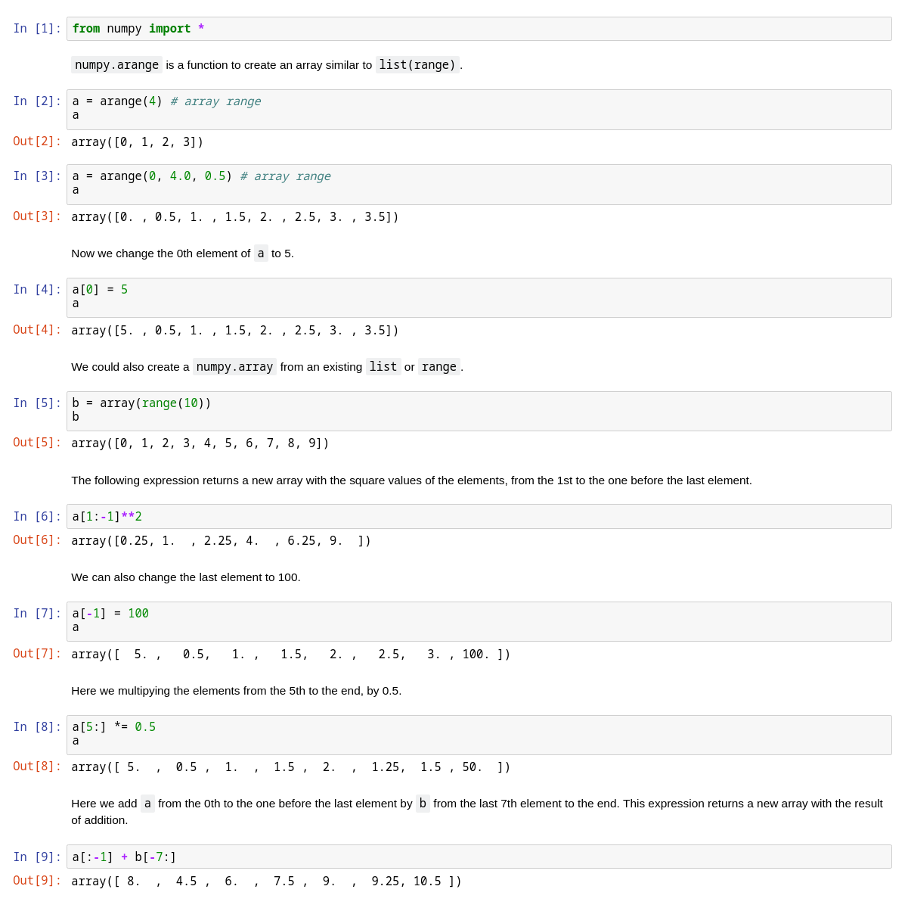

# Prior knowledge for HW9

Because we have skipped two homework assignments, I collected some important concepts associated with HW9 here.

## Module

A Python module is like a library, containing functions and classes. We can use these function and class objects by importing the module. Sounds familiar? Actually, `vpython` is a module. 

### Import a Module

In every assignments, we import all the functions (like `mag`) and classes (like `sphere`) of this module by `from vpython import *`. Although this is an easy way to import a module, however, it's actually a dangerous way.

By the `from module import *` way, our namespace will be messes up and occupied by all the names in the module. This may cause the conflict between objects with the same names. For example, there are a module called `numpy` and another module called `array`. Both of them have a class called `array`, but these two `array` are totally different. So if we do this:

```python
from array import *
from numpy import *
```

we will always get `numpy.array` (which means the `array` class in `numpy`) by calling the name `array`. We could never get access to `array.array` because it's override by `numpy.array` when executing `from numpy import *`. 

The reason why it's dangerous is that, if we import all the names in this way, it may be hard for us to notice the conflict and solve the problem. For example, there are **627 names** in `numpy`. We can't always remember all the names.

Here are some better ways to import and use a module:

```python
# The 1st way
import numpy
a = numpy.array([1, 2, 3])
b = numpy.zeros(5)

# The 2nd way (most recommended)
import numpy as np
a = np.array([1, 2, 3])
b = np.zeros(5)

# The 3rd way
from numpy import array, zeros
a = array([1, 2, 3])
b = zeros(5)
```

We can call all the classes and functions in the module by both the 1st and 2nd ways, and the only difference between them is that we define the alias `np` so we don't have to type `numpy` every time. By the 3rd way, only `array` and `zeros` will be directly loaded into our namespace so it will be easier to handle the conflict.

### Write Our Own Module

We can write our own module. Or more precisely, all the `*.py` file is itself a module. For example, if we have two files `my_module.py` and `main.py` in the same folder, then we can do this:

```python
# my_module.py
def my_func():
    print('my_func')
```

```python
# main.py
from my_module import my_func
my_func()
```

### What is `__main__`?

In HW9, you may see this:

```python
class SomeClass:
    pass
    
def some_func():
    pass
    
if __name__ == '__main__':
    some_var = SomeClass()
    some_func()
```

The line `if __name__ == '__main__':` means that the part will only be executed if we run this script as the main program. If we import this script as a module, then `__name__` will not be `__main__`, so the lines in the `if` will not be executed every time we import the file. But if we directly run the file, those lines will be executed.

## Numpy

`numpy` is a powerful Python module, and there's a powerful class called `array` in it. It's very convenient and meanwhile very fast. Here I'll directly borrow the picture from HW7 for instrcutions:

(If the picture is too small, you can right-click and open the image in the new tab/window. It might be better.)


### np.zeros

In HW9, Professor used a function called `np.zeros`.

> The reference of `np.zeros` is over [here](https://docs.scipy.org/doc/numpy-1.15.0/reference/generated/numpy.zeros.html). (You should learn to google and read the documentation youselves in the future. It's almost the most important skill for programming lol.)

In HW9, Professor wrote 

```python
p_a, v_a = np.zeros((N,3)), np.zeros((N,3))
```

`np.zeros((N, 3))` will return an array in which all the values are zeros, and the shape of the array will be `(N, 3)`, which means the array have N rows and 3 columns. It would be something like this:


for N rows

### 2D array

The `np.zeros((N, 3))` mentioned before is a 2D array. We can get access to this array by

```python
import numpy as np

a = np.zeros((2, 3))           # Now, a == np.array([[0, 0, 0],
                               #                     [0, 0, 0]])

# Access a certain row
# (We can assign the values by either a single value, list or array)
a[1] = [1, 2, 3]

# Now, a == np.array([[0, 0, 0],
#                     [1, 2, 3]])

# Access a certain column
# The usage of ':' is just like the list
a[:, 2] = 5

# Now, a == np.array([[0, 0, 5],
#                     [1, 2, 5]])

# Access one certain element
# (First the row index, then the column index)
a[0, 1] = 9

# Now, a == np.array([[0, 9, 5],
#                     [1, 2, 5]])

# Use slicing in both dimensions
a[0:2, 0:2] = np.zeros((2, 2))

# Now, a == np.array([[0, 0, 5],
#                     [0, 0, 5]])
``` 
